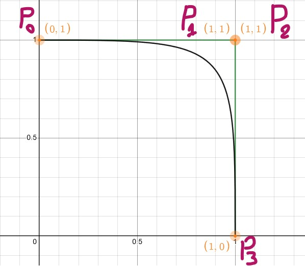

# Shrine User Education Animation - (Material Design 2)

A simple prototype for [Shrine](https://m2.material.io/design/material-studies/shrine.html#motion) User Education animation.

[Shrine User Education Animation](https://github.com/darkwhite220/ShrineUserEducationAnimation/assets/53045980/f8e6d079-6d29-4b78-b711-418aab248d43)

## Content

The app containt 2 same animations:

1- A Box with background that can be anything (exp: product image)

2- A render of the item that has been redirectred to an Android Picture, then create a Bitmap out of it (onItemClick) and use it in Image and make it the moving object. This needs implementation of [Ui.Graphics v1.6.0-alpha01](https://developer.android.com/jetpack/androidx/releases/compose-ui#1.6.0-alpha01)

## Result
The Bezier Curve used.

**Example 1**

[Example 1](https://github.com/darkwhite220/ShrineUserEducationAnimation/assets/53045980/d2ffefa7-1d46-4d5c-9816-119c4ee03f09)

*Notice item index between the two examples*

**Example 2 with redirect rendering**

[Example 2 with redirect rendering](https://github.com/darkwhite220/ShrineUserEducationAnimation/assets/53045980/814df5f2-3283-4df1-bf4c-ba9438e34656)

## What I learned

- Bezier Curve
- Redirecting rendering to an Android Picture 

## Learning resource

- [Easing in to Easing Curves in Jetpack Compose](https://medium.com/androiddevelopers/easing-in-to-easing-curves-in-jetpack-compose-d72893eeeb4d)
- [The Beauty of Bézier Curves - Youtube](https://www.youtube.com/watch?v=aVwxzDHniEw)
- [Bezier Curve Playground- Desmos](https://www.desmos.com/calculator/d1ofwre0fr)
- [Redirecting Rendering](https://github.com/android/snippets/blob/main/compose/snippets/src/main/java/com/example/compose/snippets/graphics/AdvancedGraphicsSnippets.kt#L92)

